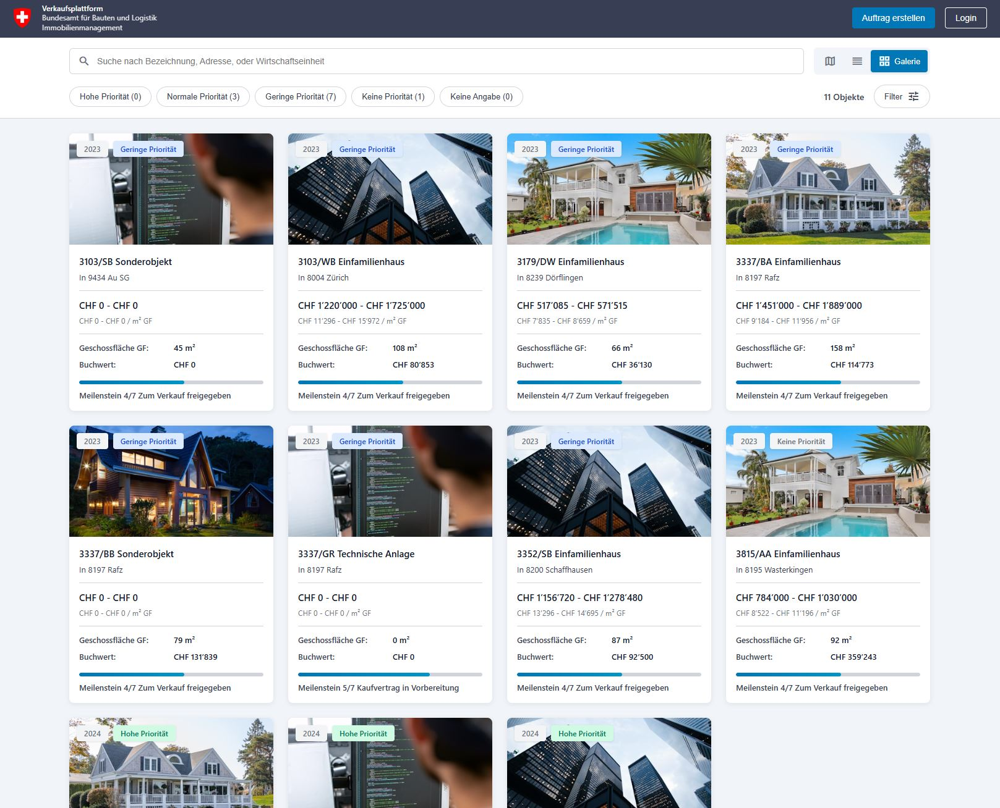
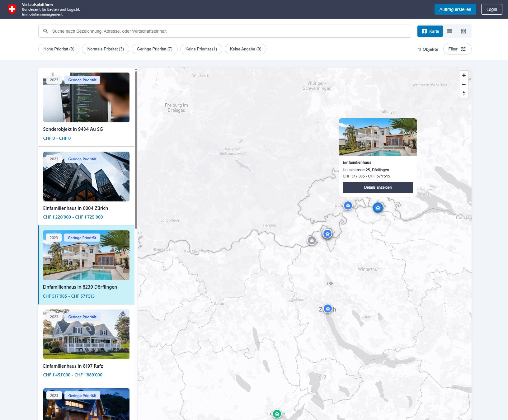
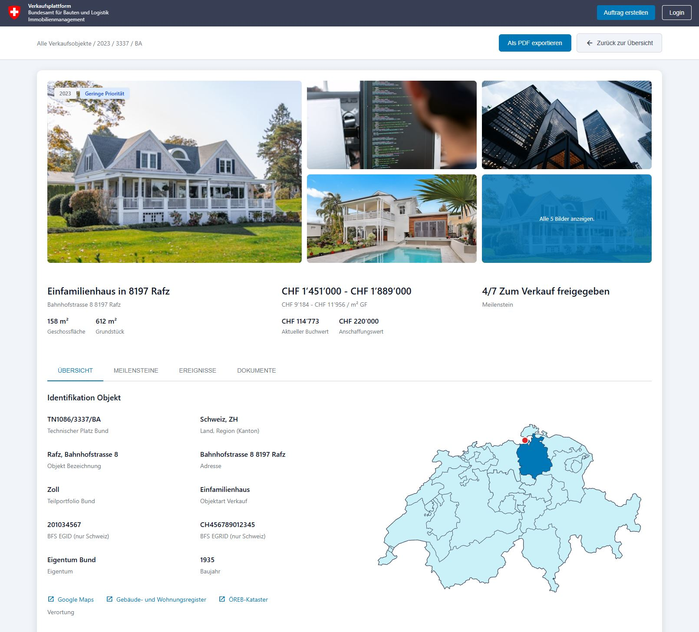

# Transaction Immo

> [!CAUTION]
> **This is an unofficial mockup for demonstration purposes only.**
> All data is fictional. Not all features are fully functional. This project serves as a visual and conceptual prototype — it is not intended for production use.

A prototype for web-based real estate transaction management platform for the Swiss Federal Office for Buildings and Logistics (Bundesamt für Bauten und Logistik - BBL). This platform enables visualization, filtering, and management of federal government properties available for sale across Switzerland.

- **LIve Demo:** https://bbl-dres.github.io/transaction-immo/

<p align="center">
  
</p>

<p align="center">
  
  
</p>

## Features

- **Three View Modes**: Gallery grid, sortable list table, and interactive Mapbox map
- **Advanced Filtering**: Multi-criteria filtering by priority, canton, property type, year, condition, and more
- **Property Details**: Comprehensive information including specifications, pricing, location ratings, milestone tracking, and document management
- **Real-time Search**: Instant text search across property titles and addresses
- **URL State Persistence**: Shareable filtered views via URL parameters
- **Responsive Design**: Optimized for desktop, tablet, and mobile devices

## Tech Stack

- **Frontend**: Vanilla HTML5, CSS3, JavaScript (ES6+)
- **Mapping**: Mapbox GL JS v3.0.1
- **Icons**: Material Design Icons
- **Data**: JSON

Zero dependencies - no build process required.

## Getting Started

1. Clone the repository:
   ```bash
   git clone https://github.com/davras5/transaction-immo.git
   cd transaction-immo
   ```

2. Serve the files using any static file server:
   ```bash
   # Using Python
   python -m http.server 8000

   # Using Node.js (npx)
   npx serve
   ```

3. Open `http://localhost:8000` in your browser

## Project Structure

```
transaction-immo/
├── index.html            # Main HTML structure
├── css/
│   ├── tokens.css        # Design tokens (CSS custom properties)
│   └── styles.css        # Component styles
├── js/
│   └── main.js           # Application JavaScript
├── assets/
│   ├── switzerland.svg   # Map background asset
│   └── images/           # Image assets
├── data/
│   └── data.json         # Property data
└── README.md
```

## License

Licensed under [MIT](https://opensource.org/licenses/MIT)

---

> [!CAUTION]
> **This is an unofficial mockup for demonstration purposes only.**
> All data is fictional. Not all features are fully functional. This project serves as a visual and conceptual prototype — it is not intended for production use.
